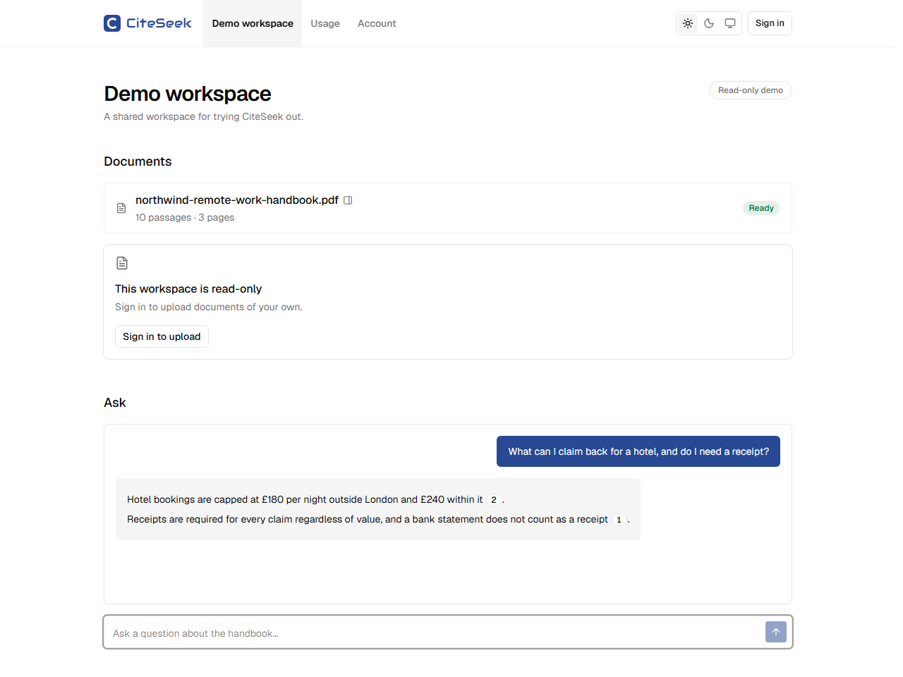
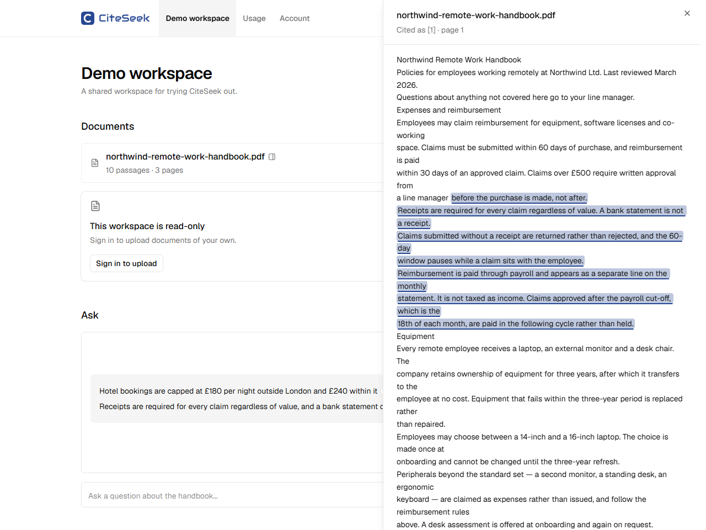
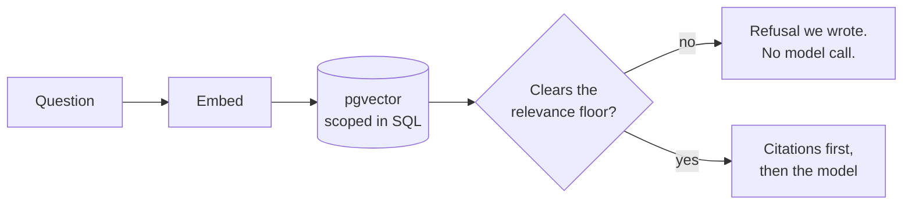
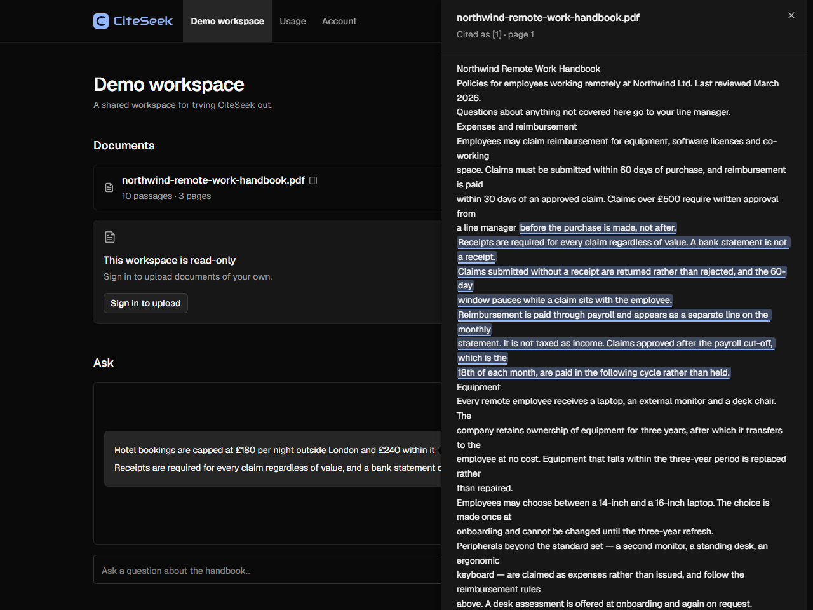

# CiteSeek

AI document assistant: upload documents, ask questions, get streaming answers with
clickable citations to exact source passages.

**Live:** [citeseek.app](https://citeseek.app) — click **Try the demo**;
no account needed.

<a href="docs/images/answer.png"></a>

<sub>Screenshots are thumbnails — click for full size. Regenerate with `pnpm demo:shots`.</sub>

## The problem this solves

An assistant that reads your documents is easy to build and hard to trust. The failure mode
is not a wrong answer — it is a **plausible** answer you cannot check, or a citation that
looks authoritative and points at nothing.

So the work here is not the chat. It is making a citation a **verifiable claim about
retrieval**: every chunk stores the character offsets it came from, the answer carries those
offsets forward, and clicking `[1]` opens the source document scrolled to that exact passage
with the text highlighted. If the stored quote no longer matches the document, the panel says
so rather than highlighting the wrong paragraph.

<a href="docs/images/source.png"></a>

The part worth stealing is the guarantee underneath it. **When nothing retrieved clears the
relevance floor, the model is never called at all** — the route returns a refusal it wrote
itself. A hallucinated citation is not unlikely here; it is unreachable, because there was no
generation step in which to invent one
([ADR 011](docs/decisions/011-retrieval-and-citation-strategy.md)).

## How a question is answered



Read the two edges out of the decision node together — they are the whole design.

The refusal branch never reaches a model, which is what makes "no relevant passages" a
structural outcome rather than a prompt instruction the model may ignore. The answer branch
writes **the citations before generation begins**, so a marker resolves against a payload
that already exists. The model chooses which passages to cite; it cannot invent what it is
citing.

That ordering is also why the [Numbers](#numbers) below report two separate figures: the
stream's first byte at ~460 ms is the citation payload, and the first token of prose at
~1.03 s is the model. They are different events, and quoting only the smaller one would be
flattering and wrong.

Workspace scoping is enforced in the SQL of that vector search, not by filtering afterwards
in JavaScript. Every query helper takes a workspace id; unscoped ones do not exist, and a
cross-tenant integration test keeps it that way.

## Decisions worth defending

Full reasoning for each is in [`docs/decisions/`](docs/decisions/); these are the ones that
shaped the product rather than the toolchain.

| ADR                                                                          | Decision                                      | Why it matters                                                                            |
| ---------------------------------------------------------------------------- | --------------------------------------------- | ----------------------------------------------------------------------------------------- |
| [006](docs/decisions/006-deployment-topology.md)                             | Functions in `fra1`, beside the database      | Cut a database-backed route by 66%; every query had been crossing the Atlantic twice      |
| [008](docs/decisions/008-chunking-strategy.md)                               | Structure-aware chunks with character offsets | Offsets are what make a citation resolvable to a passage rather than to a document        |
| [011](docs/decisions/011-retrieval-and-citation-strategy.md)                 | Relevance floor short-circuits generation     | A refusal cannot cite, because no model runs on that branch                               |
| [013](docs/decisions/013-chat-persistence.md)                                | Guest conversations are never written down    | Keeps an unbounded write path off a public URL                                            |
| [014](docs/decisions/014-usage-limiting.md)                                  | Count provider calls, not questions           | A refusal still costs an embedding, and refusals are what an abuser generates             |
| [016](docs/decisions/016-workspace-membership-deferred.md)                   | No roles table                                | A role column whose only value is `owner` adds a branch no user can reach                 |
| [017](docs/decisions/017-answering-questions-the-documents-cannot-answer.md) | The refusal says where the answer lives       | Every word written by us — an ungrounded turn must not read as if it were grounded        |
| [018](docs/decisions/018-theme-persistence-and-the-flash.md)                 | Theme in a cookie, not `localStorage`         | The server renders the right palette on the first byte, so there is no flash to correct   |
| [020](docs/decisions/020-measuring-the-relevance-floor.md)                   | Measure the relevance floor, then lower it    | The shipped threshold refused nothing; the distributions overlap, so no value is right    |
| [021](docs/decisions/021-hybrid-retrieval-measured-and-not-shipped.md)       | Build hybrid retrieval, then reject it        | Every fusion weight scored worse than vector alone, so the standard answer was wrong here |

## What works today

> **Status: Milestone 5.** Upload a PDF, Word document,
> Markdown or text file, then ask questions about it. Answers stream, and every claim carries a
> numbered citation that opens the source document scrolled to the exact passage — and the
> documents themselves open from the list, because knowing what is in one is how you work out
> what to ask it. When nothing
> relevant is found, the answer says so, cites nothing, and shows what the documents _do_
> cover along with how to add one ([ADR 017](docs/decisions/017-answering-questions-the-documents-cannot-answer.md)).
>
> Signed in, conversations are kept: each has its own URL, and they can be listed, resumed,
> renamed and deleted. There is an account page with real deletion, and a per-workspace usage
> page reporting provider calls and tokens. Light, dark and system themes, with no flash on
> first paint and no JavaScript required. A [privacy page](<app/(marketing)/privacy/page.tsx>)
> that states what is stored, where, and who else sees it — written from the code rather than a
> template.
>
> The shape of the work is in [`docs/strategy-plan.md`](docs/strategy-plan.md), a snapshot
> written at the start and deliberately not maintained — where it and the built result differ,
> that difference is explained in the ADR that caused it. This line is the status.

## Numbers

Measured, not estimated, from a European vantage point against the deployed app unless a row
says otherwise. Latency figures are medians of repeated requests, and the first sample in each
set includes a cold start and is kept in the data rather than discarded. Where a measurement
needed a different method — a streamed response, or a headless browser — the method is stated
beside it, because "1 second" means nothing without knowing what was being timed.

**Function region colocation** — moving Vercel Functions from the default `iad1`
(Washington DC) to `fra1` (Frankfurt), beside the Neon database:

| Route                              | Before | After  |          |
| ---------------------------------- | ------ | ------ | -------- |
| `/sign-in` — dynamic, no query     | 234 ms | 149 ms | −36%     |
| `/demo` — dynamic + database query | 395 ms | 134 ms | **−66%** |

The `/demo` result is the interesting one: it went from _slower_ than a route that touches
no database to marginally faster. Every query had been crossing the Atlantic twice.
See [`docs/decisions/006-deployment-topology.md`](docs/decisions/006-deployment-topology.md).

**Ingestion**, measured on the deployed app from the document's own status
timestamps — a 51-page PDF, 1.03 MB, producing 32 passages:

| Stage                  | Elapsed    |
| ---------------------- | ---------- |
| Upload → `processing`  | 347 ms     |
| `processing` → `ready` | 1,456 ms   |
| **Total**              | **1.80 s** |

Against the 300-second serverless ceiling that is 0.6% of budget, which is what settles
whether background ingestion needs a queue: it does not. Extrapolating to the 600-chunk
document limit gives roughly 19 embedding batches at 2 concurrent calls — on the order of
tens of seconds. The binding constraint is the embedding provider's requests-per-minute,
not function duration.

The sample is a design document at roughly 517 characters per page, so it is light on text
for its page count; a dense report of the same length would produce closer to 500 passages.
The figure above proves the path works end to end in production, not that the ceiling has
been stressed.

**Time to first token** — the deployed app, as a guest, asking a question the demo document
answers. Two figures, because only one of them is TTFT:

| Measured from request start        | Median |
| ---------------------------------- | ------ |
| First byte of the stream (sources) | 461 ms |
| **First token of the answer**      | 1.03 s |

The stream opens before the model is called at all: the citation payload is written first, as
a fact about retrieval rather than a summary of what the model claimed. So a reader sees
sources resolve at ~460 ms and prose begin at ~1 s.

Four samples rather than five — the fifth was refused by this project's own rate limiter,
which is the intended behavior and a reasonable way to find out it works in production.

**Client bundle**, measured by reading the scripts the page actually serves. The Milestone 2
entry here claimed the 428 KB markdown chunk — a parser, a
diagram renderer, a syntax highlighter and a maths typesetter — was lazy and absent from the
initial payload. **Measuring it showed the opposite**: it was in the initial HTML of every
workspace visit. Loading `Answer` through `next/dynamic` fixed that, since no conversation
needs a markdown renderer before it has an answer in it:

Before and after are both the local production build, so the comparison is like for like:

| Scripts on `/w/[id]` | Before  | After   |          |
| -------------------- | ------- | ------- | -------- |
| Raw                  | 1670 KB | 1244 KB | −26%     |
| Transferred          | 468 KB  | 338 KB  | **−28%** |

The deployed app measured 1671 KB / 459 KB before the change, which is the same build within
compression noise — worth stating, because a before/after that quietly swaps environments
mid-table is how a real regression gets hidden by an unrelated improvement.

**Lighthouse**, mobile emulation with its default throttling (Slow 4G, 4× CPU). The workspace
needs a guest cookie: `proxy.ts` redirects a credential-less `/w/*` to `/sign-in`, so an
anonymous run scores a different page entirely.

| Page                               | Performance | Accessibility | Best practices | SEO |
| ---------------------------------- | ----------- | ------------- | -------------- | --- |
| `/` landing — deployed             | 98          | 100           | 100            | 100 |
| `/w/[id]` guest — deployed, before | 87          | 100           | 100            | 100 |
| `/w/[id]` guest — local build      | 84 → **90** | 100           | 100            | 100 |

**Retrieval quality**, measured by `pnpm eval:retrieval` against a golden set of 51 questions
over three documents written for the purpose — 41 answerable, 10 answerable by none of them.
Expected passages are recorded as quotes and resolved to character offsets at run time, so
re-chunking moves the mapping rather than invalidating the set. Full run in
[`eval/report.md`](eval/report.md); reasoning in
[ADR 020](docs/decisions/020-measuring-the-relevance-floor.md).

| k   | recall | precision | MRR  |
| --- | ------ | --------- | ---- |
| 1   | 0.67   | 0.68      | 0.68 |
| 3   | 0.95   | 0.34      | 0.81 |
| 8   | 1.00   | 0.14      | 0.82 |

Ranking is the half that works: the passage answering the question is in the top three 95% of
the time. Precision falls with k because one passage answers the question and the other seven
cannot.

**Hybrid retrieval was built against this harness and rejected by it.** Postgres full-text search
fused with the vector results by reciprocal rank — the standard second signal, and an entry that
had sat in the backlog since Milestone 2 on the strength of the argument alone:

| lexical weight       | recall@1 | recall@3 | MRR      |
| -------------------- | -------- | -------- | -------- |
| lexical alone        | 0.39     | 0.66     | 0.53     |
| **0 (vector alone)** | **0.67** | **0.95** | **0.82** |
| 0.25                 | 0.65     | 0.85     | 0.79     |
| 0.5                  | 0.60     | 0.85     | 0.77     |
| 1.0                  | 0.61     | 0.85     | 0.77     |

Every blend is worse than vector alone, and worse the more say the lexical list is given — so it
is not wired into the answer path
([ADR 021](docs/decisions/021-hybrid-retrieval-measured-and-not-shipped.md)). The measurement
also corrected the golden set: its questions were phrased away from the documents' words, which
is right for testing a vector search and made it impossible to see what lexical search is for.
Six term-heavy questions were added, and the answer did not change.

**The relevance floor was the half that did not.** The closest chunk per question:

|              | min   | median | max   |
| ------------ | ----- | ------ | ----- |
| answerable   | 0.276 | 0.325  | 0.411 |
| unanswerable | 0.332 | 0.422  | 0.494 |

Those ranges **overlap**, so no threshold separates them — every value trades questions wrongly
refused against ungrounded questions let through. At the previously shipped `0.6` the floor
admitted **all ten** unanswerable questions; the demo's own corpus scored _"Who won the world
cup in 1998?"_ at 0.532, which `0.6` would have answered. It is now `0.40`: one answerable
question in 41 refused, half the unanswerable ones caught, and clean separation on the demo.

This is the number the project had been asserting and not measuring, and the correction is
worth more than the original claim: **the floor is a filter, not a proof.** What
[ADR 011](docs/decisions/011-retrieval-and-citation-strategy.md) guarantees is unchanged — no
model runs on the refusal branch, so a refusal cannot cite — but the branch is taken less often
than "when nothing relevant is found" suggests. Closing the gap needs a second signal (hybrid
search, reranking), not a better constant, and the harness is how either would have to prove
itself.

**Dark mode cost nothing measurable**, which is the point of storing the preference in a cookie
rather than `localStorage` ([ADR 018](docs/decisions/018-theme-persistence-and-the-flash.md)).
The usual implementation needs a render-blocking inline script to correct the first paint; a
cookie arrives with the request, so the server writes the right class and there is nothing to
correct. Landing page, local build, three runs each:

|        | Performance | Total blocking time | Script evaluation |
| ------ | ----------- | ------------------- | ----------------- |
| before | 95, 95, 95  | 30, 30, 20 ms       | 189, 186, 179 ms  |
| after  | 97, 95, 95  | 40, 20, 20 ms       | 173, 176, 180 ms  |

The first attempt at this compared **one** run against one and reported 99 → 93 with blocking
time up from 50 ms to 300 ms. That regression does not exist; total blocking time is the noisiest
metric Lighthouse reports, and a single pair cannot tell a change from variance.

<a href="docs/images/dark.png"></a>

The workspace page is short of the 95 target and the reason is specific: 124 KB of the
remaining bundle is unused Vercel AI SDK and Zod, reachable only by deferring `useChat` —
which would delay the composer becoming interactive. Trading the product's primary interaction
for five points is the wrong way round, so the gap is recorded rather than closed. LCP is the
chat panel's empty-state text, and its breakdown is 20 ms of server time against 437 ms of
render delay, so the remaining cost is script evaluation rather than anything the database
does.

## Known gaps at this milestone

**The model provider is on a free tier, and anyone who signs in can upload to it.** Under the
standard free-tier terms, submitted content may be used to improve the provider's services — so
the [privacy page](<app/(marketing)/privacy/page.tsx>) says so plainly and the warning is repeated
beside the upload control rather than buried. This is the gap that would have to close before
anyone uploaded a document that mattered: a paid tier, or written data-processing terms. It is
listed here rather than quietly deferred because the alternative is a policy that overstates its
protections, which is worse than having none.

Guest conversations are not saved — a reload starts over. That is deliberate: persisting them
would put an unbounded write path behind a public URL
([ADR 013](docs/decisions/013-chat-persistence.md)). Signed-in conversations are kept, listed
and addressable; the demo has no history because nothing about a guest is written down.

Workspaces have a single owner and cannot be shared. Roles and membership were planned for
Milestone 4 and deliberately cut: the structural claim they would make — authorization enforced
in the data layer rather than by hiding buttons — is already true and proven by the cross-tenant
tests, and a role column whose only production value is `owner` adds a branch no user can reach
([ADR 016](docs/decisions/016-workspace-membership-deferred.md)).

The workspace page scores 90 on Lighthouse rather than the 95 this project set as its bar. The
cause is measured and recorded above; closing it means deferring chat hydration, which is a
worse trade than the points are worth.

**Half the ungrounded questions still reach the model.** The relevance threshold is now measured
rather than guessed ([ADR 020](docs/decisions/020-measuring-the-relevance-floor.md)), and what
the measurement showed is that no threshold is right: the distance distributions for answerable
and unanswerable questions overlap. At `0.40` roughly half the questions the corpus cannot
answer still clear the floor. They reach a model instructed to answer only from the passages it
was given — so the failure is a weak answer rather than an invented citation — but "says so when
nothing relevant is found" is a weaker promise than it sounds, and closing the gap needs a
second retrieval signal rather than a better constant.

Usage limits are enforced but their thresholds are provisional — they need real traffic to
calibrate against, and are deliberately generous because shared addresses
(office networks, mobile carriers) put many visitors in one bucket
([ADR 014](docs/decisions/014-usage-limiting.md)).

Email magic-link sign-in is deferred until an email sender is configured — GitHub OAuth and
guest mode both work. The demo workspace is read-only by design, so uploading requires signing
in. Tracked in [`docs/backlog.md`](docs/backlog.md).

## What's next

**Milestone 6 is an in-browser inference mode**: the same documents and the same citation
path, with a small model running locally through WebGPU. Nothing leaves the machine, which
turns the free-tier caveat in [Known gaps](#known-gaps-at-this-milestone) from a limitation
into a choice the reader makes per question. Quality drops; the guarantee that a refusal
cannot cite does not, because it is enforced before any model is reached.

Before that, the gap [ADR 020](docs/decisions/020-measuring-the-relevance-floor.md) measured:
the floor cannot separate answerable questions from unanswerable ones on distance alone, so the
next retrieval work is a **second signal** — lexical search fused with the vector scores, or a
reranker over the top k. Both are parked in [`docs/backlog.md`](docs/backlog.md), and both now
have a way to prove they earned their place rather than an argument that they should.

The usage thresholds are still starting values. They need real traffic rather than another
round of reasoning.

## Stack

Next.js 16 (App Router) · React 19 · TypeScript 5.9 (strict) · Tailwind v4 ·
shadcn/ui · Postgres 18 + pgvector · Drizzle ORM · Auth.js v5 · Vitest + Testing Library ·
Playwright · GitHub Actions · Vercel + Neon

## Getting started

Requires Node 24 (see `.nvmrc`) and pnpm 11.

```bash
nvm use                      # Node 24 LTS
pnpm install                 # also enables the git hooks in .githooks/
cp .env.example .env.local   # fill in DATABASE_URL
docker compose up -d         # or point DATABASE_URL at a Neon branch
pnpm db:migrate
pnpm db:seed
pnpm dev                     # http://localhost:3000
```

## Commands

```bash
pnpm dev               # dev server
pnpm build             # production build
pnpm test              # vitest unit tests (no database needed)
pnpm test:integration  # vitest against a real Postgres (needs DATABASE_URL)
pnpm test:e2e          # playwright (builds and serves automatically)
pnpm lint              # eslint, type-aware
pnpm typecheck         # tsc --noEmit
pnpm format            # prettier --write
```

Run by hand, never in CI, output committed:

```bash
pnpm eval:retrieval    # retrieval quality against eval/golden-set.ts (needs a real key)
pnpm demo:shots        # the README screenshots, against a running instance
pnpm demo:pdf          # regenerates the demo fixture from its HTML source
```

Database:

```bash
docker compose up -d   # local Postgres 18 + pgvector
pnpm db:migrate        # apply migrations (creates the vector extension too)
pnpm db:seed           # demo workspace; idempotent
pnpm db:generate       # emit a new migration after editing lib/db/schema.ts
pnpm db:studio         # browse the database
```

Every `db:*` command reads its connection from `.env.local`, which points at a **development**
branch. Production is a different branch of the same Neon project, and because Neon branches
are copy-on-write clones they carry **identical row ids** — so a command aimed at production
and run against dev succeeds, prints ids that look right, and changes nothing anybody can see.
The hostname is the only thing that distinguishes them, so `pnpm db:seed` refuses to touch a
remote database until you have named the one you mean — and printing it was not enough, twice.

```bash
DATABASE_URL_UNPOOLED='<production-unpooled-url>' pnpm db:check
DATABASE_URL_UNPOOLED='<production-unpooled-url>' pnpm db:migrate

SEED_HOST='<your-production-endpoint>' EMBEDDINGS_PROVIDER=google \
  DATABASE_URL_UNPOOLED='<production-unpooled-url>' pnpm db:seed
```

Set `DATABASE_URL_UNPOOLED`, not `DATABASE_URL`. Schema changes go through the **unpooled**
endpoint, because the pooled one is PgBouncer in transaction mode and DDL wants a session that
outlives a statement. And a variable you leave unset is not empty: `.env.local` fills it in, so
overriding only `DATABASE_URL` leaves the development `DATABASE_URL_UNPOOLED` in place and
migrates development while reporting success.

**If your Postgres has no pooler, ignore all of this.** Every `db:*` command resolves
`DATABASE_URL_UNPOOLED ?? DATABASE_URL`, so on Docker, a plain server, or CI you leave the first
one unset and everything runs off `DATABASE_URL`. Two variables are only needed where the
provider hands you two URLs for the same database — Neon (`-pooler` in the hostname or not),
Supabase (port 6543 or 5432), RDS with a proxy in front. `DATABASE_URL_UNPOOLED` is Neon's own
name for it, which is why their Vercel integration sets it for you.

`SEED_HOST` is any fragment that tells your branches apart — Neon names each endpoint
independently, so yours differ from anyone else's. It is matched against the hostname the
connection actually resolves to, so aiming at one branch and reaching another is a refusal
naming both rather than a success. Read from the shell only: putting it in `.env.local` would
let one file supply both the wrong answer and the confirmation of it.

**You do not have to go looking for the value**: run the command without it and the refusal
prints the `export SEED_HOST=…` line for the host it actually reached. In Neon's console it is
the first segment of the connection hostname (`ep-…`), shown per branch under Connect.

`format:check`, `lint`, `typecheck`, `test`, `build`, integration tests, and the
Playwright smoke suite all gate every pull request.

## Testing

| Layer       | Count | What it covers                                                                                  |
| ----------- | ----- | ----------------------------------------------------------------------------------------------- |
| Unit        | 514   | Chunking, extraction, embeddings, prompts, citation markers, usage policy, restored transcripts |
| Integration | 136   | Real Postgres: ingestion, retrieval, chat, usage limits, conversation ownership, cascades       |
| E2E         | 81    | Guest flow, route protection, ask → stream → cite → source panel, capacity states, axe          |

The pure core — `lib/rag` and `lib/ai` — is held to ≥90% coverage, enforced in CI.

Deterministic fakes for both providers (`EMBEDDINGS_PROVIDER=fake`, `CHAT_PROVIDER=fake`)
exercise ingestion, retrieval and the whole answer path with no API key and no network, so CI
and local development need neither. The fake embedder is a hashing bag-of-words vectorizer:
text sharing words lands close together, which is enough for a real question to retrieve a
real passage end to end. It is not semantic, and says nothing about retrieval quality — that
needs the real provider, and the relevance floor is calibrated per embedding model for
exactly that reason.

A live model would also make "the answer cites `[1]`" a coin toss rather than an assertion.

Integration tests run against a throwaway pgvector container in CI rather than a shared
database, so they also prove the migration applies cleanly to an empty database on every
pull request.

## Branching

`main` is protected by a `pre-push` hook in [`.githooks/`](.githooks/): direct pushes are
refused, so every change goes through a pull request and CI runs before it lands. The hook
is enabled by `pnpm install`; if it ever seems inactive, run `pnpm run prepare`.

This is a local guard rather than a security control — `--no-verify` bypasses it. It exists
to catch an absent-minded `git push origin main`, which is the realistic failure mode on a
solo repository. Server-side enforcement needs GitHub branch protection, which is free on
public repositories but requires a paid plan for private ones.

## Project conventions

- **The milestone plan** is in [`docs/strategy-plan.md`](docs/strategy-plan.md) — a snapshot,
  not a status page.
- **Decisions** worth defending are recorded in [`docs/decisions/`](docs/decisions/).
- **Corrections made on review** are logged in [`docs/code-review-notes.md`](docs/code-review-notes.md).
- **Out-of-milestone ideas** go to [`docs/backlog.md`](docs/backlog.md), not the current branch.

## License

There is no license file, which means all rights are reserved — the default, and here a
deliberate one. Read it, learn from it, quote it, link to it. GitHub's own terms let any
GitHub user view and fork a public repository whatever its license, so that stands too. What
is not granted is everything outside that: copying this into a product, or redistributing it
elsewhere.

Built with AI-assisted tooling (Claude Code) under close review — see
[`docs/decisions/`](docs/decisions/) for the architectural reasoning.
