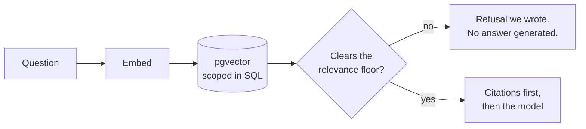

# CiteSeek

AI document assistant: upload documents, ask questions, get streaming answers with
clickable citations to exact source passages.

**Live:** [citeseek.app](https://citeseek.app) — click **Try the demo**;
no account needed.

<a href="docs/images/answer.png"></a>

<sub>Screenshots are thumbnails — click for full size. Regenerate with `pnpm demo:shots`, which
shoots production and so runs after a deploy rather than before.</sub>

## The problem this solves

An assistant that reads your documents is easy to build and hard to trust. The failure mode
is not a wrong answer — it is a **plausible** answer you cannot check, or a citation that
looks authoritative and points at nothing.

So the work here is not the chat. It is making a citation a **verifiable claim about
retrieval**: every chunk stores the character offsets it came from, the answer carries those
offsets forward, and clicking `[1]` opens the source document scrolled to that exact passage
with the text highlighted. If the stored quote no longer matches the document, the panel says
so rather than highlighting the wrong paragraph.

<a href="docs/images/source.png"></a>

The part worth stealing is the guarantee underneath it. **When nothing retrieved clears the
relevance floor, no answer is generated** — the route returns a refusal it wrote itself. A
hallucinated citation is not unlikely here; it is unreachable, because no prose was written
for one to hide in ([ADR 011](docs/decisions/011-retrieval-and-citation-strategy.md)).

One model call does happen on that branch, and it is not an answer: a follow-up that retrieved
nothing is rewritten into a standalone search query and searched again. That output is used as
a query and shown to the reader as one — never as prose, and never as something a citation can
attach to ([ADR 044](docs/decisions/044-rewriting-a-follow-up-only-after-it-fails.md)).

## How a question is answered



Read the two edges out of the decision node together — they are the whole design.

The refusal branch generates no answer, which is what makes "no relevant passages" a
structural outcome rather than a prompt instruction the model may ignore. The answer branch
writes **the citations before generation begins**, so a marker resolves against a payload
that already exists. The model chooses which passages to cite; it cannot invent what it is
citing.

That ordering is also why the [Numbers](#numbers) below report two separate figures: the
stream's first byte at ~365 ms is the citation payload, and the first token of prose at
~0.85 s is the model. They are different events, and quoting only the smaller one would be
flattering and wrong.

Workspace scoping is enforced in the SQL of that vector search, not by filtering afterward
in JavaScript. Every query helper takes a workspace id; unscoped ones do not exist, and a
cross-tenant integration test keeps it that way.

## Decisions worth defending

Full reasoning for each is in [`docs/decisions/`](docs/decisions/); these are the ones that
shaped the product rather than the toolchain.

| ADR                                                                          | Decision                                      | Why it matters                                                                            |
| ---------------------------------------------------------------------------- | --------------------------------------------- | ----------------------------------------------------------------------------------------- |
| [006](docs/decisions/006-deployment-topology.md)                             | Functions in `fra1`, beside the database      | Cut a database-backed route by 66%; every query had been crossing the Atlantic twice      |
| [008](docs/decisions/008-chunking-strategy.md)                               | Structure-aware chunks with character offsets | Offsets are what make a citation resolvable to a passage rather than to a document        |
| [011](docs/decisions/011-retrieval-and-citation-strategy.md)                 | Relevance floor short-circuits generation     | A refusal cannot cite, because no model runs on that branch                               |
| [013](docs/decisions/013-chat-persistence.md)                                | Guest conversations are never written down    | Keeps an unbounded write path off a public URL                                            |
| [014](docs/decisions/014-usage-limiting.md)                                  | Count provider calls, not questions           | A refusal still costs an embedding, and refusals are what an abuser generates             |
| [016](docs/decisions/016-workspace-membership-deferred.md)                   | No roles table                                | A role column whose only value is `owner` adds a branch no user can reach                 |
| [017](docs/decisions/017-answering-questions-the-documents-cannot-answer.md) | The refusal says where the answer lives       | Every word written by us — an ungrounded turn must not read as if it were grounded        |
| [018](docs/decisions/018-theme-persistence-and-the-flash.md)                 | Theme in a cookie, not `localStorage`         | The server renders the right palette on the first byte, so there is no flash to correct   |
| [020](docs/decisions/020-measuring-the-relevance-floor.md)                   | Measure the relevance floor, then lower it    | The shipped threshold refused nothing; the distributions overlap, so no value is right    |
| [021](docs/decisions/021-hybrid-retrieval-measured-and-not-shipped.md)       | Build hybrid retrieval, then reject it        | Every fusion weight scored worse than vector alone, so the standard answer was wrong here |
| [029](docs/decisions/029-a-store-the-server-cannot-see.md)                   | Local documents live in IndexedDB alone       | The privacy claim is structural: deletion cannot reach what was never sent                |
| [034](docs/decisions/034-answering-on-the-gpu.md)                            | Name the device the capability gate checks    | The gate refused browsers a feature that ran without a GPU, because nothing asked for one |
| [035](docs/decisions/035-where-the-worked-example-goes.md)                   | A worked example belongs in the system prompt | In the message array it is transcript, and the model answered out of it with a citation   |
| [039](docs/decisions/039-the-default-plan-s-ceiling.md)                      | Stock limits are not the rate limiter         | A limit that never heals has to name what to delete; one that heals only has to wait      |

## Mistakes worth reading

The decisions above are the ones that worked. [`docs/code-review-notes.md`](docs/code-review-notes.md)
is the other half — 95 entries of _issue found → fix → lesson_, written when review caught a bug, a
wrong assumption, or a better approach. Not all of them are the tooling's.

Four that show the shape of it:

- [**A performance regression that did not exist**](docs/code-review-notes.md) — three wrong
  guesses deep before anything was measured, and the measurement said the change had made no
  difference at all.
- [**The metric that could not see half of what it measured**](docs/code-review-notes.md) — the
  relevance floor, the mechanism this project's headline claim rests on, was admitting **ten of
  ten** unanswerable questions in production. Every test passed throughout, because they run a fake
  embedder whose distances live in an unrelated range. A fake can prove a mechanism and hide the
  number that makes it work.
- [**A deletion promise the schema could not keep**](docs/code-review-notes.md) — the privacy page
  said account deletion removes "every usage record". No cascade reached that table, and production
  data showed a deleted account still carrying tokens. Found by looking at real data, not by a test.
- [**The bug that needed a person**](docs/code-review-notes.md) — the local model's worked example
  was sent as conversation turns, which a model reads as things that were said. Typing `cite`
  returned the example's own sentence carrying a citation that **resolved**, so the chip opened a
  real passage of the reader's document that had nothing to do with the claim — a fabricated claim
  wearing a working citation, in one word, deterministically. The entire gate — unit suite,
  end-to-end suite, production build — was green throughout, and a multi-agent review of the same
  code found seven other defects without flagging this one. It took a real document and an odd
  thing to type.

The pattern is the same across all of them: a green suite is evidence about the thing it checks
and silent about everything else, and the useful findings came from measuring rather than
reasoning.

## What works today

> **Status: live.** Upload a PDF, Word document,
> Markdown or text file, then ask questions about it. Answers stream, and every claim carries a
> numbered citation that opens the source document scrolled to the exact passage — and the
> documents themselves open from the list, because knowing what is in one is how you work out
> what to ask it. When nothing
> relevant is found, the answer says so, cites nothing, and shows what the documents _do_
> cover along with how to add one ([ADR 017](docs/decisions/017-answering-questions-the-documents-cannot-answer.md)).
>
> Signed in, conversations are kept: each has its own URL, and they can be listed, resumed,
> renamed and deleted. There is an account page with real deletion, and a per-workspace usage
> page reporting provider calls and tokens. Light, dark and system themes, with no flash on
> first paint and no JavaScript required. A [privacy page](<app/(marketing)/privacy/page.tsx>)
> that states what is stored, where, and who else sees it — written from the code rather than a
> template.
>
> **The free plan has a ceiling, and refusing well is the feature.** Three documents, three
> conversations, forty saved messages each and 500,000 characters of extracted text. Every
> refusal names what to delete rather than quoting a number — at the document cap it points at
> the upload that _failed_, since telling someone at their limit to delete a working document is
> the version of this that reads as broken. The ceiling is shown before it bites, on the usage
> page and beside the control it will stop
> ([ADR 039](docs/decisions/039-the-default-plan-s-ceiling.md)).
>
> **Local mode is the second half, and it is marked experimental.** On a browser with WebGPU the
> same documents are parsed, indexed and answered entirely on the reader's machine: nothing is
> uploaded, no question reaches a provider, and a citation chip opens the passage out of IndexedDB
> by the same character offsets the server path uses — proven by an end-to-end test asserting the
> panel opens with **zero** requests to the API. The cost is stated before anything is fetched:
> two model downloads totalling 884 MB, cached afterwards, and answers around two to three seconds
> each, five at worst. They are also visibly worse. A model small enough to run in a tab sometimes states things
> the documents do not say, and sometimes answers citing nothing at all — the page says so before
> you start, because a privacy guarantee is not a reason to oversell the thing delivering it.
>
> The shape of the work is in [`docs/strategy-plan.md`](docs/strategy-plan.md), a snapshot
> written at the start and deliberately not maintained — where it and the built result differ,
> that difference is explained in the ADR that caused it. This line is the status.

## Numbers

Measured, not estimated, from a European vantage point against the deployed app unless a row
says otherwise. Latency figures are medians of repeated requests, and the first sample in each
set includes a cold start and is kept in the data rather than discarded. Where a measurement
needed a different method — a streamed response, or a headless browser — the method is stated
beside it, because "1 second" means nothing without knowing what was being timed.

**Function region colocation** — moving Vercel Functions from the default `iad1`
(Washington DC) to `fra1` (Frankfurt), beside the Neon database:

| Route                              | Before | After  |          |
| ---------------------------------- | ------ | ------ | -------- |
| `/sign-in` — dynamic, no query     | 234 ms | 149 ms | −36%     |
| `/demo` — dynamic + database query | 395 ms | 134 ms | **−66%** |

The `/demo` result is the interesting one: it went from _slower_ than a route that touches
no database to marginally faster. Every query had been crossing the Atlantic twice.
See [`docs/decisions/006-deployment-topology.md`](docs/decisions/006-deployment-topology.md).

**Ingestion**, measured on the deployed app from the document's own status
timestamps — a 51-page PDF, 1.03 MB, producing 59 passages:

| Stage                  | Elapsed    |
| ---------------------- | ---------- |
| Upload → `processing`  | 253 ms     |
| `processing` → `ready` | 1,472 ms   |
| **Total**              | **1.73 s** |

Against the 300-second serverless ceiling that is 0.6% of budget, which is what settles
whether background ingestion needs a queue: it does not. Extrapolating to the 600-chunk
document limit gives roughly 19 embedding batches at 2 concurrent calls — on the order of
tens of seconds. The binding constraint is the embedding provider's requests-per-minute,
not function duration.

The same PDF measured 32 passages and 1.80 s when this table was first recorded. Halving
the chunk target for citation precision ([ADR 008](docs/decisions/008-chunking-strategy.md))
nearly doubled the passage count, and the total did not move: 59 passages is two embedding
batches where 32 was one, and the two run concurrently, so both are a single round trip. The
phase that does the embedding is unchanged at ~1.47 s. That is the useful reading of these
numbers — one sample cannot resolve anything smaller.

The sample is a design document at roughly 517 characters per page, so it is light on text
for its page count. Passage count follows characters, not pages — at a 500-character effective
stride a text-dense document of the same length produces several times as many, which is the
case the 600-chunk ceiling exists for. The figure above proves the path works end to end in
production, not that the ceiling has been stressed.

**Time to first token** — the deployed app, as a guest, asking a question the demo document
answers. Two figures, because only one of them is TTFT:

| Measured from request start        | v1.3.1, by hand | v1.4.0, `perf:ttft` |
| ---------------------------------- | --------------- | ------------------- |
| First byte of the stream (sources) | 461 ms          | 365 ms              |
| **First token of the answer**      | 1.03 s          | 0.85 s              |

The stream opens before the answering model is called: the citation payload is written first,
as a fact about retrieval rather than a summary of what the model claimed. So a reader sees
sources resolve at ~365 ms and prose begin at ~0.85 s.

**Read that as a method change, not a speed-up.** An earlier run of `perf:ttft` published 502 ms
and 1.03 s from the same deployment. Two faults produced the difference and a review of this
release found both: the median took the upper of the two middle samples on an even count, and a
cold start — 1,893 ms on the run above, against a ~400 ms steady state — sat in the sample rather
than ahead of it. The script now discards a warm-up and takes a real median, so the v1.4.0 column
is the app and the v1.3.1 column is a hand measurement of unknown method. They are not a
before-and-after.

The script also refuses to time a refusal. A refusal streams in the same shape as an answer,
deliberately, so the client has one code path — and no answering model runs on that branch, so
timing one would have put a retrieval round trip into this table as a generation.

**Client bundle**, measured by reading the scripts the page actually serves. An earlier entry
here claimed the 428 KB markdown chunk — a parser, a
diagram renderer, a syntax highlighter and a maths typesetter — was lazy and absent from the
initial payload. **Measuring it showed the opposite**: it was in the initial HTML of every
workspace visit. Loading `Answer` through `next/dynamic` fixed that, since no conversation
needs a markdown renderer before it has an answer in it:

Before and after are both the local production build, so the comparison is like for like:

| Scripts on `/w/[id]` | Before  | After   |          |
| -------------------- | ------- | ------- | -------- |
| Raw                  | 1670 KB | 1244 KB | −26%     |
| Transferred          | 468 KB  | 338 KB  | **−28%** |

The deployed app measured 1671 KB / 459 KB before the change, which is the same build within
compression noise — worth stating, because a before/after that quietly swaps environments
mid-table is how a real regression gets hidden by an unrelated improvement.

**Re-measured at v1.4.0**, by `pnpm perf:bundle workspace` against a local `pnpm start`
rather than by hand: it reads the `<script>` and
preloaded-script tags the page actually serves, brotli-compresses each file, and refuses to report a
number if the page redirected or a file is missing — so two runs are comparable by construction.
Against the v1.3.1 release build on the same machine, with an identical lockfile:

| Scripts on `/w/[id]` | v1.3.1 | v1.4.0 |
| -------------------- | ------ | ------ |
| Raw                  | 976 KB | 980 KB |
| Transferred (brotli) | 253 KB | 254 KB |

Flat — which is the result the shell change was aiming at, not an improvement to claim. These are
smaller than the hand-taken figures above because the compressor and the tag set are now written
down; the two methods are comparable within themselves and not to each other.

**Lighthouse**, mobile emulation with its default throttling (Slow 4G, 4× CPU). The workspace
needs a guest cookie: `proxy.ts` redirects a credential-less `/w/*` to `/sign-in`, so an
anonymous run scores a different page entirely.

| Page, deployed  | Version | Performance | Accessibility | Best practices | SEO |
| --------------- | ------- | ----------- | ------------- | -------------- | --- |
| `/` landing     | v0.7.0  | 98          | 100           | 100            | 100 |
| `/` landing     | v1.4.0  | 98          | 100           | 100            | 100 |
| `/w/[id]` guest | v0.7.0  | 87          | 100           | 100            | 100 |
| `/w/[id]` guest | v1.4.0  | 80          | 100           | 96             | 63  |
| `/w/[id]` guest | v1.4.1  | 95          | 100           | 96             | 63  |

**The v0.7.0 rows were taken by hand on a different Chrome**, so read each row against its own
column rather than down the table — a 7-point drop across those two is partly the tooling. The
like-for-like comparison is the local one below, on one harness.

**The workspace row's SEO 100 went stale on 18 August**, when `robots.txt` began disallowing `/w`
on purpose — `app/robots.ts` says why. `is-crawlable` fails by design there and carries most of the
category's weight, so 63 is the score a page nobody should index is supposed to get. Every other SEO
audit on it passes, and the page that is meant to be found still measures 100.

Best practices at 96 is one Content Security Policy issue, logged on the workspace route and not on
the landing page. It is Zod asking whether it may compile: `try { Function("") } catch { … }`, a
capability probe it uses to decide between JIT-compiled validators and interpreted ones. The production
policy carries no `'unsafe-eval'`, so the probe throws, the `catch` runs, and Zod takes the path
that was the only available one anyway. Nothing is blocked that the app wanted.

**Re-measured at v1.4.0**, three runs per build against one local server:

| `/w/[id]` guest, local   | v1.3.1 | v1.4.0 |
| ------------------------ | ------ | ------ |
| Performance, median      | 77     | 72     |
| Cumulative layout shift  | 0.329  | 0.324  |
| Largest contentful paint | 3.2 s  | 3.6 s  |

Read those columns against each other rather than against the deployed rows above: a different
Chrome build and a busier machine. Total blocking time ranged 80–870 ms across six runs and says
nothing.

Two things it does say. **CLS ~0.33 was unchanged and was the largest deduction on both builds** —
a real shift, and the one this release fixes; the before/after is below. And LCP moved 0.4 s while
first contentful paint and speed index did not, which points at when content arrives rather than at
when the page starts painting.

**Retrieval quality**, measured by `pnpm eval:retrieval` against a golden set of 51 questions
over three documents written for the purpose — 41 answerable, 10 answerable by none of them.
Expected passages are recorded as quotes and resolved to character offsets at run time, so
re-chunking moves the mapping rather than invalidating the set. Full run in
[`eval/report.md`](eval/report.md); reasoning in
[ADR 020](docs/decisions/020-measuring-the-relevance-floor.md).

| k   | recall | precision | MRR  |
| --- | ------ | --------- | ---- |
| 1   | 0.67   | 0.68      | 0.68 |
| 3   | 0.95   | 0.34      | 0.81 |
| 8   | 1.00   | 0.14      | 0.82 |

Ranking is the half that works: the passage answering the question is in the top three 95% of
the time. Precision falls with k because one passage answers the question and the other seven
cannot.

**Hybrid retrieval was built against this harness and rejected by it.** Postgres full-text search
fused with the vector results by reciprocal rank — the standard second signal, and an entry that
had sat in the backlog since the chat route was first built, on the strength of the argument
alone:

| lexical weight       | recall@1 | recall@3 | MRR      |
| -------------------- | -------- | -------- | -------- |
| lexical alone        | 0.41     | 0.66     | 0.53     |
| **0 (vector alone)** | **0.67** | **0.95** | **0.82** |
| 0.25                 | 0.62     | 0.85     | 0.78     |
| 0.5                  | 0.61     | 0.85     | 0.76     |
| 1.0                  | 0.59     | 0.85     | 0.75     |

**A short follow-up is the case this set could not see**, so it got its own. Ten information needs
written twice — as a reader types them after a previous turn, and self-contained — score
**recall@3 0.70 as asked against 1.00 standalone**. Three in ten fail, and a clean 1.00 on the
right column means a perfect rewrite recovers all three: a ceiling, not a guess. That measurement
is what [ADR 044](docs/decisions/044-rewriting-a-follow-up-only-after-it-fails.md) was decided on,
and it was taken before anything was built.

Every blend is worse than vector alone, and worse the more say the lexical list is given — so it
is not wired into the answer path
([ADR 021](docs/decisions/021-hybrid-retrieval-measured-and-not-shipped.md)). The measurement
also corrected the golden set: its questions were phrased away from the documents' words, which
is right for testing a vector search and made it impossible to see what lexical search is for.
Six term-heavy questions were added, and the answer did not change.

**The relevance floor was the half that did not.** The closest chunk per question:

|              | min   | median | max   |
| ------------ | ----- | ------ | ----- |
| answerable   | 0.276 | 0.325  | 0.411 |
| unanswerable | 0.332 | 0.422  | 0.494 |

Those ranges **overlap**, so no threshold separates them — every value trades questions wrongly
refused against ungrounded questions let through. At the previously shipped `0.6` the floor
admitted **all ten** unanswerable questions; the demo's own corpus scored _"Who won the world
cup in 1998?"_ at 0.532, which `0.6` would have answered. It is now `0.40`: one answerable
question in 41 refused, half the unanswerable ones caught, and clean separation on the demo.

This is the number the project had been asserting and not measuring, and the correction is
worth more than the original claim: **the floor is a filter, not a proof.** What
[ADR 011](docs/decisions/011-retrieval-and-citation-strategy.md) guarantees is unchanged — no
model runs on the refusal branch, so a refusal cannot cite — but the branch is taken less often
than "when nothing relevant is found" suggests. Closing the gap needs a second signal (hybrid
search, reranking), not a better constant, and the harness is how either would have to prove
itself.

**Dark mode cost nothing measurable**, which is the point of storing the preference in a cookie
rather than `localStorage` ([ADR 018](docs/decisions/018-theme-persistence-and-the-flash.md)).
The usual implementation needs a render-blocking inline script to correct the first paint; a
cookie arrives with the request, so the server writes the right class and there is nothing to
correct. Landing page, local build, three runs each:

|        | Performance | Total blocking time | Script evaluation |
| ------ | ----------- | ------------------- | ----------------- |
| before | 95, 95, 95  | 30, 30, 20 ms       | 189, 186, 179 ms  |
| after  | 97, 95, 95  | 40, 20, 20 ms       | 173, 176, 180 ms  |

The first attempt at this compared **one** run against one and reported 99 → 93 with blocking
time up from 50 ms to 300 ms. That regression does not exist; total blocking time is the noisiest
metric Lighthouse reports, and a single pair cannot tell a change from variance.

<a href="docs/images/dark.png"></a>

The workspace page is short of the 95 target, and at v1.4.0 the reason changed. It used to be
bundle weight: 124 KB of unused Vercel AI SDK and Zod, reachable only by deferring `useChat`,
which would delay the composer becoming interactive — the product's primary interaction traded
for five points, so the gap was recorded rather than closed.

That is no longer what binds. The deployed v1.4.0 breakdown:

| Weight | Score | Value | Metric                   |
| ------ | ----- | ----- | ------------------------ |
| 10     | 100   | 0.9 s | First contentful paint   |
| 25     | 88    | 2.6 s | Largest contentful paint |
| 30     | 99    | 70 ms | Total blocking time      |
| 25     | 35    | 0.324 | Cumulative layout shift  |
| 10     | 100   | 0.9 s | Speed index              |

Total blocking time — where script weight lands — scores **99** on the heaviest-weighted metric.
Layout shift scores **35** and carries a quarter of the total, so one metric costs roughly 16
points and the page is otherwise at its target. `layout-shift-elements` names a single element for
0.3235 of the 0.324: the footer, positioned by content height with `mt-auto`, moving when
`loading.tsx` hands over to content taller than its skeleton.

**Fixed in v1.4.1 by reserving the conversation panel in the skeleton**, which had reserved the
documents half only. Six lines of markup, against the bundle refactor it replaces — which would
have traded the composer's interactivity for five points. Deployed:

| `/w/[id]` guest, deployed | v1.4.0          | v1.4.1     |
| ------------------------- | --------------- | ---------- |
| Cumulative layout shift   | 0, 0.324, 0.324 | **0 × 15** |
| Performance, median       | 80              | **95**     |

Fifteen points, and the metric that carried a quarter of the weight now scores 100 — so the
workspace route meets the 95 this project set as its bar, for the first time.

Fifteen samples, five invocations of three: the median was **95 every time**, and cumulative layout
shift was **0 in all fifteen**. Individual runs ranged 90 to 96, and that spread is entirely total
blocking time between 100 ms and 150 ms — largest contentful paint held at 2.7 s throughout, which
is what makes it the honest thing to point at next. It scores **84**, and nothing else fell below 94.

Measured with `pnpm perf:lighthouse`, which pins its Lighthouse version because scores move between
releases. The figure does depend on the connection it is taken over: the same build over a busier
link measured 89, with the whole difference in largest contentful paint.

The signed-in routes were measured too, and do not shift: the guest page is the shortest, so its
footer sits in the viewport with somewhere to move, while every signed-in variant is taller and
starts it below the fold.

## Known gaps at this milestone

**Document text still leaves the EU, and the privacy page cannot say where it lands.** Storage is
pinned to Frankfurt — Vercel `fra1`, Neon in the same region, both in configuration rather than
left to a default. Processing is not: answers come from Google's Gemini API, whose standard
endpoint carries no residency commitment, so "EU-hosted" is exact about storage and silent about
where the model runs. Closing it means a regional endpoint or a European provider, and the
second is the more interesting version of the question ([ADR 025](docs/decisions/025-paying-for-the-model-tier.md)).

**Narrowed, August 2026, not closed.** Local mode answers this outright for anyone who takes it —
no text leaves the machine at all — but it is opt-in, experimental, and materially worse at
answering, so it is an escape hatch rather than a fix. The gap stands for the default path.

~~The provider is on a free tier whose terms permit using submitted content for product
improvement.~~ **Closed, August 2026.** The project runs on the paid tier now, so that content is
not used for training or improvement. The entry stayed here for four milestones because the
disclosure felt like a fix; it was not, since asking people not to upload anything sensitive is a
request rather than a protection, and the people named _inside_ an uploaded document never read
the request at all.

Guest conversations are not saved — a reload starts over. That is deliberate: persisting them
would put an unbounded write path behind a public URL
([ADR 013](docs/decisions/013-chat-persistence.md)). Signed-in conversations are kept, listed
and addressable; the demo has no history because nothing about a guest is written down.

Workspaces have a single owner and cannot be shared. Roles and membership were planned once and
deliberately cut: the structural claim they would make — authorization enforced
in the data layer rather than by hiding buttons — is already true and proven by the cross-tenant
tests, and a role column whose only production value is `owner` adds a branch no user can reach
([ADR 016](docs/decisions/016-workspace-membership-deferred.md)).

The workspace page reaches the Lighthouse 95 this project set as its bar, as the median of three
in five consecutive invocations.
It scored 80 at v1.4.0. Deferring chat
hydration — the reason recorded here for four milestones — was never what bound it; a footer
positioned by content height was, and six lines of skeleton markup closed it.

What is left is largest contentful paint at 2.7 s, and it is the skeleton's own price. Lighthouse
splits it as 636 ms to first byte and **2,100 ms of render delay**, with nothing spent fetching —
the element is text, and `curl` has the whole document 25 ms after the first byte. `loading.tsx`
makes the segment a Suspense boundary, so the skeleton paints at 0.9 s while the real content
arrives inside `<div hidden>` and waits for React's swap script, on a CPU throttled 4×. First
paint and largest paint are in tension here by construction: this route spends 0.9 s to get 2.7 s.
Measured locally with the boundary removed, every metric improves — performance 87 → 92 — and
layout shift stays at 0, so the skeleton is covering a wait of about 190 ms that is not there on
the warm path.

**It is kept anyway, and the reason is a number this measurement does not take.** Lighthouse as run
here only ever performs a cold full-page load; the skeleton exists for a navigation. Entering the
workspace from `/account` on a connection throttled to 400 ms latency and 4× CPU, five runs each,
the content appears at ~2,150 ms either way — but the destination commits at **460 ms** with the
boundary and **1,670 ms** without it. The progress bar rises at ~290 ms in both cases, so the
difference is not feedback against none: it is 1.2 s spent on the page you asked for rather than
the page you left. Five Lighthouse points for that, deliberately and by a margin worth naming
([ADR 045](docs/decisions/045-what-the-loading-skeleton-buys.md)).

**Half the ungrounded questions still reach the model.** The relevance threshold is now measured
rather than guessed ([ADR 020](docs/decisions/020-measuring-the-relevance-floor.md)), and what
the measurement showed is that no threshold is right: the distance distributions for answerable
and unanswerable questions overlap. At `0.40` roughly half the questions the corpus cannot
answer still clear the floor. They reach a model instructed to answer only from the passages it
was given — so the failure is a weak answer rather than an invented citation — but "says so when
nothing relevant is found" is a weaker promise than it sounds, and closing the gap needs a
second retrieval signal rather than a better constant.

Usage limits are enforced but their thresholds are provisional — they need real traffic to
calibrate against, and are deliberately generous because shared addresses
(office networks, mobile carriers) put many visitors in one bucket
([ADR 014](docs/decisions/014-usage-limiting.md)). Those are a _flow_ limit, counting provider
calls in a rolling window, and they heal as the window slides. The plan caps above are a _stock_
limit and never heal — which is why they are a separate system rather than a second threshold on
the same one, and why only they have to name what to delete
([ADR 039](docs/decisions/039-the-default-plan-s-ceiling.md)). Both sets of numbers are guesses
until there is traffic.

Email magic-link sign-in is deferred until an email sender is configured — GitHub OAuth and
guest mode both work. The demo workspace is read-only by design, so uploading requires signing
in. Tracked in [`docs/backlog.md`](docs/backlog.md).

## What's next

**In-browser inference shipped** — it is described in [What works
today](#what-works-today), and it answered the residency gap by making it a choice rather than by
narrowing it. What it leaves open is answer quality rather than plumbing, and the sharpest piece
is this: a model that fits in a tab sometimes answers **citing nothing at all**, which the reader
has no way to see. Counting citations is trivial; the difficulty is that an uncited answer is
_correct_ when it is a refusal, so a flat warning would fire on the honest case as often as the
fabricated one. Telling those apart is the next work on that path.

Separately, the gap [ADR 020](docs/decisions/020-measuring-the-relevance-floor.md) measured: the
floor cannot separate answerable questions from unanswerable ones on distance alone, so retrieval
still wants a **second signal**. Hybrid search was the obvious candidate and
[ADR 021](docs/decisions/021-hybrid-retrieval-measured-and-not-shipped.md) measured it losing, so
what remains is a reranker over the top k — or accepting the floor as a filter and saying so.
Both are in [`docs/backlog.md`](docs/backlog.md), and both now have a harness that would prove
they earned their place rather than an argument that they should.

The usage thresholds are still starting values. They need real traffic rather than another
round of reasoning.

## Stack

Next.js 16 (App Router) · React 19 · TypeScript 5.9 (strict) · Tailwind v4 ·
shadcn/ui · Postgres 18 + pgvector · Drizzle ORM · Auth.js v5 · Vitest + Testing Library ·
Playwright · GitHub Actions · Vercel + Neon

Local mode adds transformers.js over ONNX Runtime Web on WebGPU, with IndexedDB for documents,
passages and their vectors. The runtime is served from this origin rather than a CDN, so the only
remote host local mode reaches is the one holding the model weights
([ADR 032](docs/decisions/032-the-only-remote-hosts-local-mode-needs.md)).

## Getting started

Requires Node 24 (see `.nvmrc`) and pnpm 11.

```bash
nvm use                      # Node 24 LTS
pnpm install                 # also enables the git hooks in .githooks/
cp .env.example .env.local   # fill in DATABASE_URL
docker compose up -d         # or point DATABASE_URL at a Neon branch
pnpm db:migrate
pnpm db:seed
pnpm dev                     # http://localhost:3000
```

## Commands

```bash
pnpm dev               # dev server
pnpm build             # production build
pnpm test              # vitest unit tests (no database needed)
pnpm test:integration  # vitest against a real, disposable Postgres (see below)
pnpm test:e2e          # playwright (serves an existing build — run pnpm build first)
pnpm lint              # eslint, type-aware
pnpm typecheck         # tsc --noEmit
pnpm format            # prettier --write
```

Run by hand, never in CI, output committed:

```bash
pnpm eval:retrieval    # retrieval quality against eval/golden-set.ts (needs a real key)
pnpm demo:shots        # the README screenshots, against a running instance
pnpm demo:pdf          # regenerates the demo fixture from its HTML source
pnpm brand:icons       # the app icons, from scripts/brand/mark.svg
pnpm brand:card        # the social card, against a running instance
```

Database:

```bash
docker compose up -d   # local Postgres 18 + pgvector
pnpm db:migrate        # apply migrations (creates the vector extension too)
pnpm db:seed           # demo workspace; idempotent
pnpm db:generate       # emit a new migration after editing lib/db/schema.ts
pnpm db:studio         # browse the database
```

Every `db:*` command reads its connection from `.env.local`, which points at a **development**
branch. Production is a different branch of the same Neon project, and because Neon branches
are copy-on-write clones they carry **identical row ids** — so a command aimed at production
and run against dev succeeds, prints ids that look right, and changes nothing anybody can see.
The hostname is the only thing that distinguishes them, so `pnpm db:seed` refuses to touch a
remote database until you have named the one you mean — and printing it was not enough, twice.

```bash
DATABASE_URL_UNPOOLED='<production-unpooled-url>' pnpm db:check
DATABASE_URL_UNPOOLED='<production-unpooled-url>' pnpm db:migrate

SEED_HOST='<your-production-endpoint>' EMBEDDINGS_PROVIDER=google \
  DATABASE_URL_UNPOOLED='<production-unpooled-url>' pnpm db:seed
```

Set `DATABASE_URL_UNPOOLED`, not `DATABASE_URL`. Schema changes go through the **unpooled**
endpoint, because the pooled one is PgBouncer in transaction mode and DDL wants a session that
outlives a statement. And a variable you leave unset is not empty: `.env.local` fills it in, so
overriding only `DATABASE_URL` leaves the development `DATABASE_URL_UNPOOLED` in place and
migrates development while reporting success.

**If your Postgres has no pooler, ignore all of this.** Every `db:*` command resolves
`DATABASE_URL_UNPOOLED ?? DATABASE_URL`, so on Docker, a plain server, or CI you leave the first
one unset and everything runs off `DATABASE_URL`. Two variables are only needed where the
provider hands you two URLs for the same database — Neon (`-pooler` in the hostname or not),
Supabase (port 6543 or 5432), RDS with a proxy in front. `DATABASE_URL_UNPOOLED` is Neon's own
name for it, which is why their Vercel integration sets it for you.

`SEED_HOST` is any fragment that tells your branches apart — Neon names each endpoint
independently, so yours differ from anyone else's. It is matched against the hostname the
connection actually resolves to, so aiming at one branch and reaching another is a refusal
naming both rather than a success. Read from the shell only: putting it in `.env.local` would
let one file supply both the wrong answer and the confirmation of it.

**You do not have to go looking for the value**: run the command without it and the refusal
prints the `export SEED_HOST=…` line for the host it actually reached. In Neon's console it is
the first segment of the connection hostname (`ep-…`), shown per branch under Connect.

Two other commands guard themselves the same way, under their own names: `pnpm eval:retrieval`
uses `EVAL_HOST` (it ingests documents and spends embedding quota) and `pnpm db:usage` uses
`USAGE_HOST` (it reads, but reading the wrong branch gives a confident wrong answer). The
schema commands above need neither — `db:check` changes nothing and prints the host it reached,
and `db:migrate` carries no data and spends no quota.

`pnpm test:integration` guards itself differently, because it is the one command with no correct
answer on a remote host: it truncates `usage_events` outright, so no naming ceremony makes that
safe against a database anybody cares about. It refuses any host that is not loopback unless you
claim the database is disposable with `INTEGRATION_DB_IS_DISPOSABLE=yes`. Put **both**
`DATABASE_URL` and `DATABASE_URL_UNPOOLED` in `.env.test.local`, which is read _before_
`.env.local` and therefore wins — so the app keeps pointing at your development branch while the
tests stay on Docker, and neither needs overriding per run.

Both, because the guard checks both, and it checks both because the suite reads both: the HNSW
plan test connects through `DATABASE_URL_UNPOOLED ?? DATABASE_URL`, since a pooler rejects the
startup options it needs. Setting only the first is the same one-of-two mistake the schema
commands above warn about, and it fails as an empty result rather than an error.

`format:check`, `lint`, `typecheck`, `test`, `build`, integration tests, and the
Playwright smoke suite all gate every pull request.

## Testing

| Layer       | Count | What it covers                                                                                                |
| ----------- | ----- | ------------------------------------------------------------------------------------------------------------- |
| Unit        | 888   | Chunking, extraction, embeddings, prompts, citation markers, usage policy, restored transcripts, local mode   |
| Integration | 198   | Real Postgres: ingestion, retrieval, chat, plan caps under concurrency, conversation ownership, cascades      |
| E2E         | 150   | Guest flow, route protection, ask → stream → cite → source panel, capacity states, plan caps, local mode, axe |

The pure core — `lib/rag`, `lib/ai` and `lib/local` — is held to ≥90% coverage, enforced in CI.

Deterministic fakes for both providers (`EMBEDDINGS_PROVIDER=fake`, `CHAT_PROVIDER=fake`)
exercise ingestion, retrieval and the whole answer path with no API key and no network, so CI
and local development need neither. The fake embedder is a hashing bag-of-words vectorizer:
text sharing words lands close together, which is enough for a real question to retrieve a
real passage end to end. It is not semantic, and says nothing about retrieval quality — that
needs the real provider, and the relevance floor is calibrated per embedding model for
exactly that reason.

A live model would also make "the answer cites `[1]`" a coin toss rather than an assertion.

Integration tests run against a throwaway pgvector container in CI rather than a shared
database, so they also prove the migration applies cleanly to an empty database on every
pull request.

Beyond the suite, every pull request is scanned. **CodeQL** runs on the workflows and the
TypeScript, currently with no open alerts — its first run found three real ones, all the same
missing `permissions` block on the CI jobs. **Dependabot** watches dependencies weekly, grouped so
patch bumps arrive as one reviewable PR rather than a queue.
[`SECURITY.md`](SECURITY.md) says what is in scope, and what is already known and accepted — the
section most policies leave out and the one that saves a reporter an evening.

## Branching

`main` is protected by a `pre-push` hook in [`.githooks/`](.githooks/): direct pushes are
refused, so every change goes through a pull request and CI runs before it lands. The hook
is enabled by `pnpm install`; if it ever seems inactive, run `pnpm run prepare`.

This is a local guard rather than a security control — `--no-verify` bypasses it. It exists
to catch an absent-minded `git push origin main`, which is the realistic failure mode on a
solo repository. Server-side enforcement needs GitHub branch protection, which is free on
public repositories but requires a paid plan for private ones.

**Releases.** `develop` integrates; `main` is the released line and carries the tags. A release
is a pull request from `develop` to `main`, the version in `package.json` bumped to match, then
an annotated tag whose subject names the milestone — a minor bump per milestone, a patch for
work that is not one (`v1.1.1`). Vercel deploys `main`.

The version does not follow the tag by itself, and has been corrected after the fact more than
once. Nor does `main` always sit on a tag: a hotfix goes straight there and is merged back down,
so being a few commits ahead of the last release is expected rather than a mistake. Afterward,
`pnpm demo:shots` if anything visible changed — it photographs production, so it cannot run
before the deploy.

## Project conventions

- **The milestone plan** is in [`docs/strategy-plan.md`](docs/strategy-plan.md) — a snapshot,
  not a status page.
- **Decisions** worth defending are recorded in [`docs/decisions/`](docs/decisions/).
- **Corrections made on review** are logged in [`docs/code-review-notes.md`](docs/code-review-notes.md).
- **Out-of-milestone ideas** go to [`docs/backlog.md`](docs/backlog.md), not the current branch.

## License

There is no license file, which means all rights are reserved — the default, and here a
deliberate one. Read it, learn from it, quote it, link to it. GitHub's own terms let any
GitHub user view and fork a public repository whatever its license, so that stands too. What
is not granted is everything outside that: copying this into a product, or redistributing it
elsewhere.

Built with AI-assisted tooling (Claude Code) under close review — see
[`docs/decisions/`](docs/decisions/) for the architectural reasoning.
